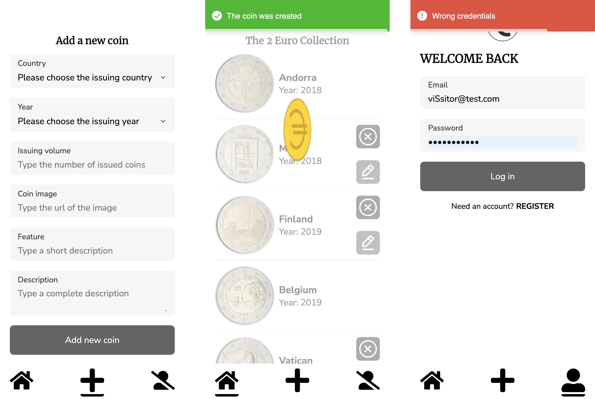

# The 2 Euro Collection

The 2 Euro Collection is a web application that allows you to keep track of the commemorative 2 euro coins. It is build using React with Redux Toolkit and tested Jest. Styles were made using Styled Components.

[Go to The2Euro](https://the2euro.vercel.app/)

## Features

- Guest visitors:
  - can see all the coins in the collection and go to the detail page
- Registered visitors:
  - can create new coins and add them to the main collection
  - can delete their created coins

## Tech Stack

## Future implementation

- Allow registered visitors to edit their coins

## Getting Started

To get started using The2Euro, you'll need to have the following tools installed:

- Node.js

Clone the repository and install all the needed dependencies.

**`npm install`**

To run the build use

**`npm start`**

## Testing

To run the testing suites use
**`npm test`**

## Backend

This is a full stack project, you can find the backend code [here](https://github.com/rom-dem/the2euro-back)
